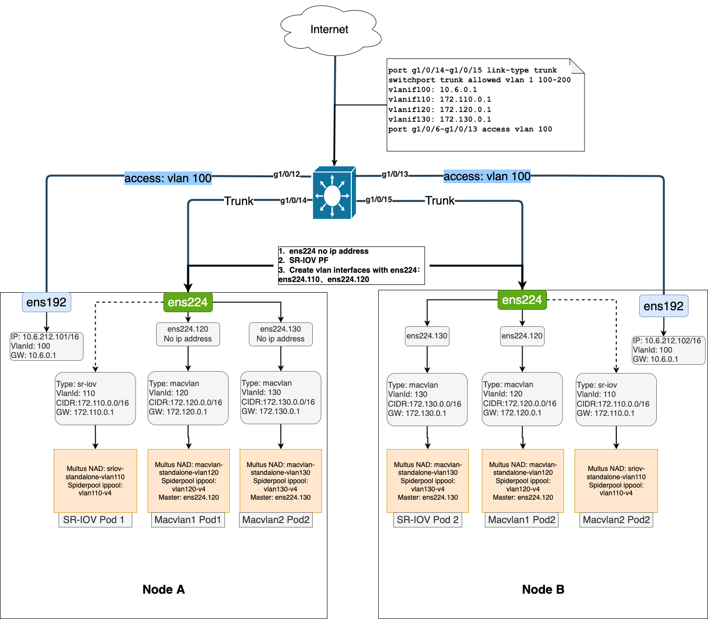
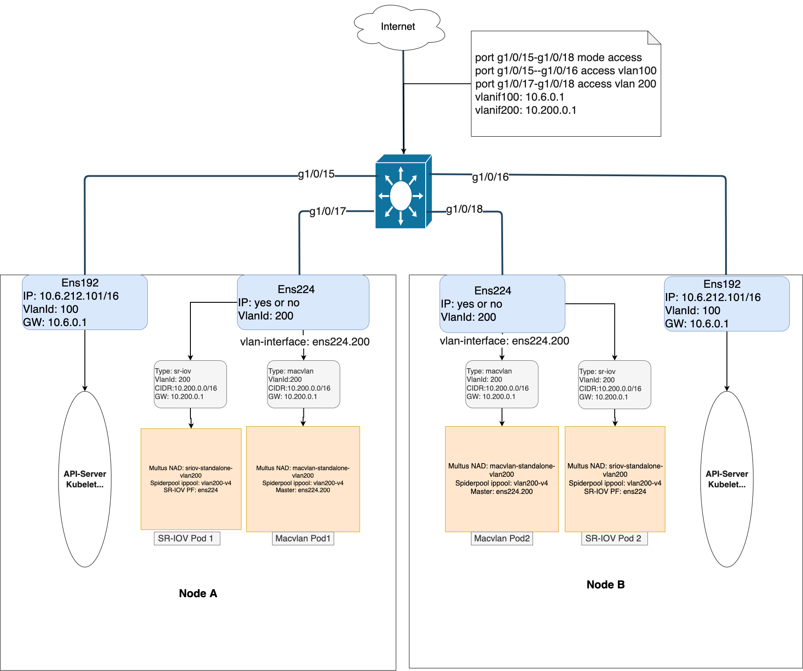
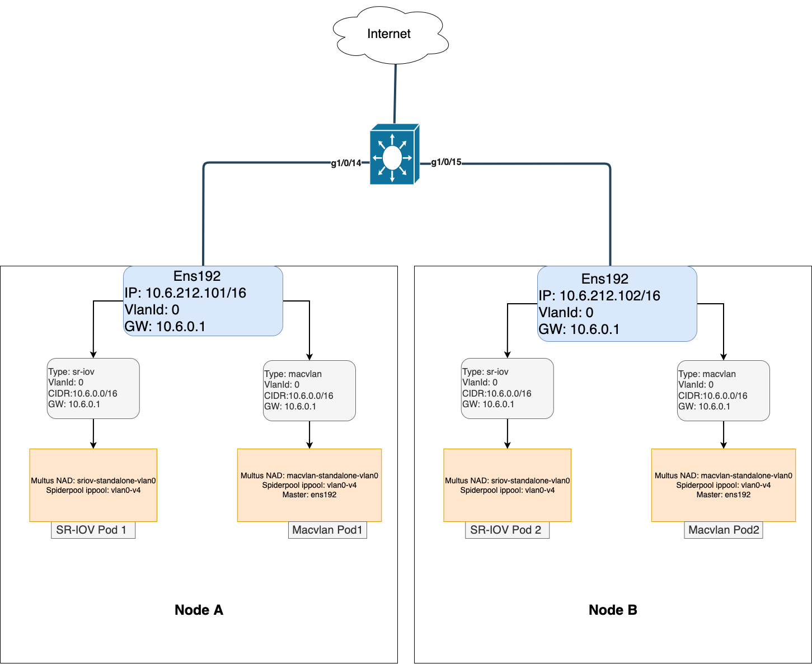

# Advanced Usages

The docs introduce some advanced usages in overlay cni(calico) + underlay cni(macvlan、sriov) hybrid scenario. 

## Prerequisites

- You have to deploy a cluster, and install a CNI(calico or cilium)、multus、[spiderpool](https://github.com/spidernet-io/spiderpool.git). More details see [Install](install.md).
- Each node has at least two NICs, one for the admin network and one for the business network. and if you use `Macvlan CNI`, Each node has at least one physical NIC with the same name(This is used as the macvlan's master interface).
- You have to set `promisc` to `on` when you're using `Macvlan` on VM. Refer to [Enable Promisc on VM](https://kb.vmware.com/s/article/1004099?lang=en_us).
- Hardware support required to use `SR-IOV CNI`(Network Interface Cards with [SR-IOV](http://blog.scottlowe.org/2009/12/02/what-is-sr-iov) capabilities). More details see [SR-IOV CNI](https://github.com/k8snetworkplumbingwg/sriov-cni).
- If you use [vlan](https://wiki.linuxfoundation.org/networking/vlan) to isolate network traffic from different networks(`admin` and `business` network), You need a switch as your network's vlan gateway.

## Advanced usages

### calico + macvlan/sriov with one NIC

- **Macvlan/SR-Iov in different vlan tag**

The network topology is shown below:

Note:

> a. `ens192` is link to switch's access interface, vlan tag is vlan 100. It is used as k8s cluster admin network, such as api-server and kubelet, etc.
> 
> b. `g1/0/14` and `g1/0/15` are in mode trunk. And permit allowed vlan 1、100-200. They are both link to `ens224`.
> 
> c. `ens224` is link to switch's trunk interface, It is used as k8s cluster business network.
> 
> d. The NIC `ens224` has no configure ip address. and it with [SR-IOV](http://blog.scottlowe.org/2009/12/02/what-is-sr-iov) capabilities are managed through physical functions (PFs) and virtual functions (VFs).
> 
> e. Create vlan interface `ens224.120` and `ens224.130` with `ens224` on node, vlan tag is vlan 120 and vlan 130. They serve as the master interface for macvlan pod. Note: `ens224.120` and `ens224.130` do not need to configure ip address.
> 
> f. The gateway of business pod are on the switch.

- **Macvlan and SR-Iov in same vlan tag**

The network topology is shown below:

> a. `ens192` is link to switch's access interface, vlan tag is vlan 100. It is used as k8s cluster admin network, such as api-server and kubelet, etc.
> 
> b. `ens224` is link to switch's access interface, It is used as k8s cluster business network. vlan tag is vlan 200. and configured IPs is optional.
> 
> c. `ens224` is sriov's PFs, and create vlan interface `ens224.120` with `ens224` on node, It serves as the master interface for macvlan pod. Note: Configured IPs for `ens224.120` is optional. If the IP is configured, it must belong to the vlan120 subnet.
> 
> d. All sriov pods and macvlan pods must be on the same subnet as vlan120("`10.200.0.0/16`"),And their gateways are both `10.200.0.1`.

- **Without Vlan/Trunk**

The network topology is shown below:

Note:

> a. Each node has only one NIC with the name ens192. Which is used in the k8s admin network and business network.
> 
> b. Since `a`, Both the k8s admin network and the business network must belong to the same subnet. For example: `10.6.0.0/16`

## Q & A

- When you're using `macvlan`, Do physical NICs need to be configured with IPs?

There are two cases here:

1. If the NIC is link to switch's trunk interface, This NIC cannot be configured with IP.
2. If the NIC is link to switch's access interface, Configuring IP is optional. 

- Does the vlan sub-interface need to be configured with IPs ?

No, It's optional. Yes or no it will work fine.

- Does the sriov PF need to be configured with IPs ?

This is related to network topology:

1. If the sriov PF is link to switch's trunk, This NIC cannot be configured with IP. 
2. If the NIC is link to switch's access interface, Configuring IP is optional. 

- Can `sriov` and `macvlan` be used based on the same NIC?

Yes, Please see the image of the network topology above.

- When `sriov` and `macvlan` are used together, Do they have to have different subnets or vlanId?

No, They can be the same subnet or vlanId, It also works well.
